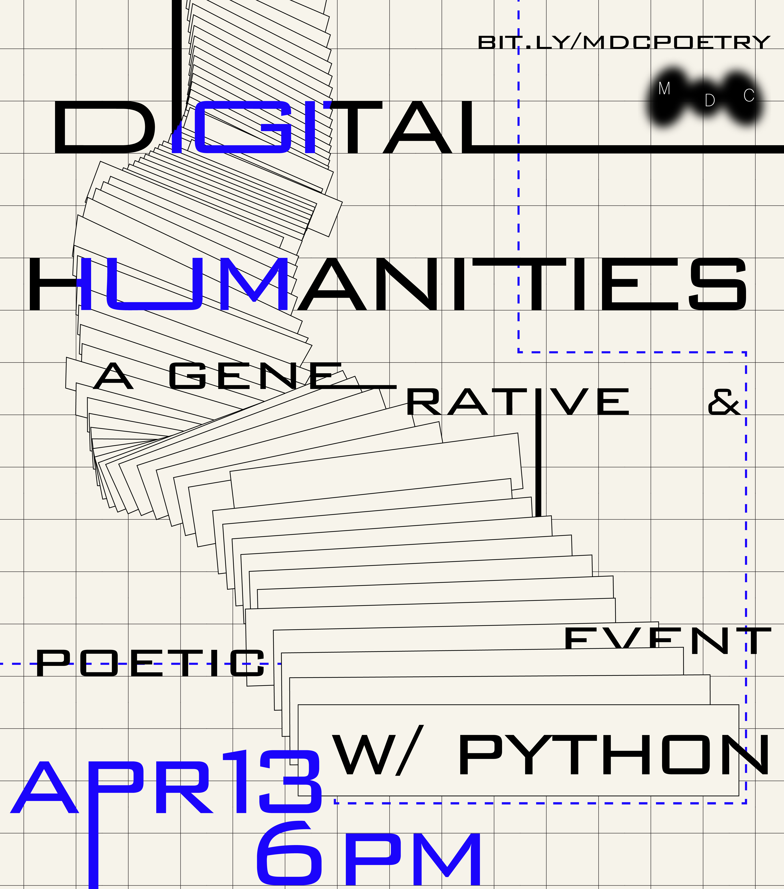

# Computational Poetry Workshop

This is a workshop in computational poetry for [Medium Design Collective](https://cornellmedium.design/).

The project repository can be found on github [here](https://github.com/danagong/computational-poetry). But you can run and open this notebook in the cloud by launching [Binder](https://mybinder.org/v2/gh/danagong/computational-poetry.git/HEAD).
